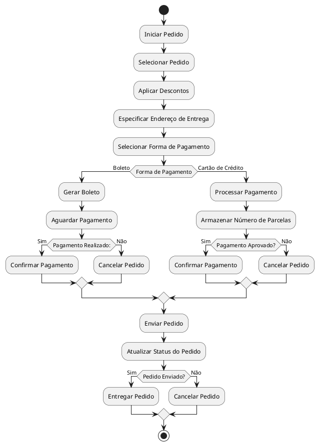
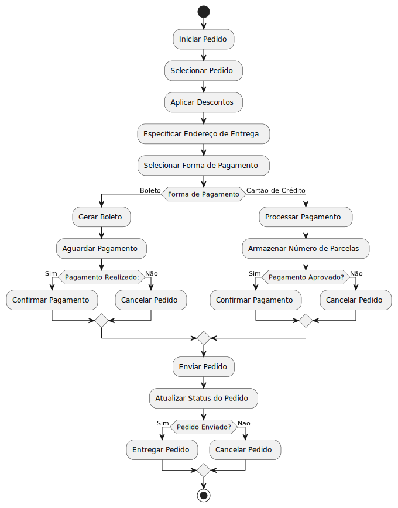

## Diagrama de Atividades 

```plantuml 
@startuml
'Processo do Pedido até a Entrega
start
:Iniciar Pedido;
:Selecionar Pedido;
:Aplicar Descontos;
:Especificar Endereço de Entrega;
:Selecionar Forma de Pagamento;
if (Forma de Pagamento) then (Boleto)
   :Gerar Boleto;
   :Aguardar Pagamento;
   if (Pagamento Realizado:) then (Sim)
      :Confirmar Pagamento;
   else (Não)
      :Cancelar Pedido;
   endif
else (Cartão de Crédito)
   :Processar Pagamento;
   :Armazenar Número de Parcelas;
   if (Pagamento Aprovado?) then (Sim)
      :Confirmar Pagamento;
   else (Não)
      :Cancelar Pedido;
  endif
endif

:Enviar Pedido;
:Atualizar Status do Pedido;

if (Pedido Enviado?) then (Sim)
   :Entregar Pedido;
else (Não)
   :Cancelar Pedido;
endif

stop 
@enduml
```

