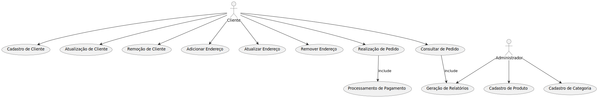

## Caso de Uso##

### Atores ###
1. Cliente
2. Administrador

### Casos de Uso ###
1. Cadastro de Produto 
2. Cadastro de Categoria 
3. Cadastro de Cliente
4. Atualização de Cliente 
5. Remoção de Cliente
6. Adicionar Endereço
7. Atualizar Endereço
8. Remover Endereço
9. Realização de Pedido 
10. Consultar de Pedido 
11. Processamento de Pagamento 
12. Geração de Relatórios

### Diagrama de Caso de Uso ###

```
PlantUML

@startuml 
actor Cliente 
actor Administrador

usecase "Cadastro de Produto" as UC1 
usecase "Cadastro de Categoria" as UC2
usecase "Cadastro de Cliente" as UC3
usecase "Atualização de Cliente" as UC4 
usecase "Remoção de Cliente" as UC5
usecase "Adicionar Endereço" as UC6
usecase "Atualizar Endereço" as UC7
usecase "Remover Endereço" as UC8
usecase "Realização de Pedido" as UC9 
usecase "Consultar de Pedido" as  UC10
usecase "Processamento de Pagamento" as UC11  
usecase "Geração de Relatórios" as UC12

Cliente --> UC3
Cliente --> UC4
Cliente --> UC5
Cliente --> UC6
Cliente --> UC7
Cliente --> UC8
Cliente --> UC9
Cliente --> UC10

Administrador --> UC1
Administrador --> UC2
Administrador --> UC12

UC9 --> UC11 : include
UC10 --> UC12 : include

@enduml
```


