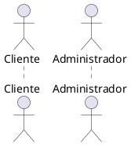

## Caso de Uso##

### Atores ###
1. Cliente
2. Administrador

### Casos de Uso ###
1. Cadastro de Produto 
2. Cadastro de Categoria 
3. Cadastro de Cliente
4. Atualização de Cliente 
5. Remoção de Cliente
6. Adicionar Endereço
7. Atualizar Endereço
8. Remover Endereço
9. Realização de Pedido 
10. Consultar de Pedido 
11. Processamento de Pagamento 
12. Geração de Relatórios

### Diagrama de Caso de Uso###

