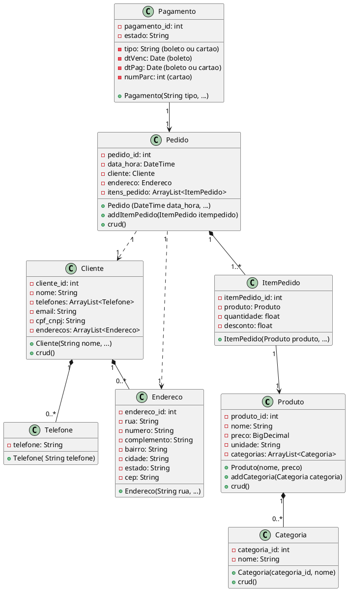
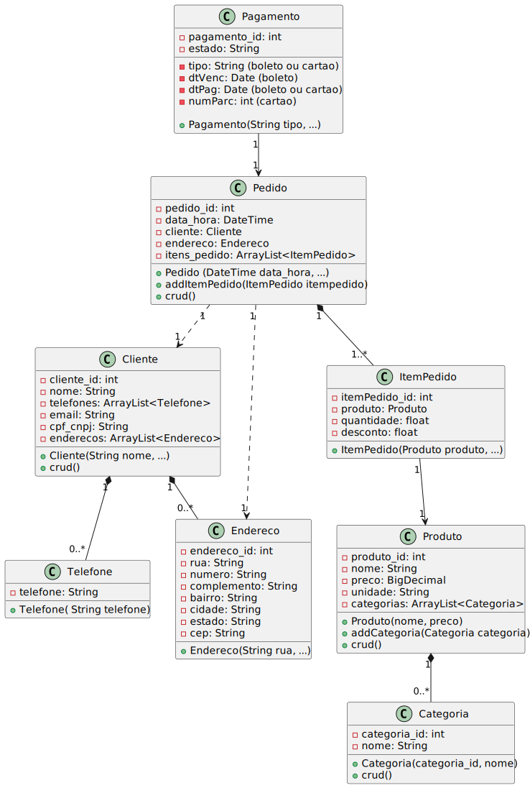

```plantuml
@startuml 
class Produto {
  - produto_id: int
  - nome: String
  - preco: BigDecimal 
  - unidade: String
  - categorias: ArrayList<Categoria>
  
  + Produto(nome, preco)
  + addCategoria(Categoria categoria)
  + crud()
  
}

class Categoria {
  - categoria_id: int 
  - nome: String
  
  + Categoria(categoria_id, nome)
  + crud()
}

class Cliente {
  - cliente_id: int
  - nome: String 
  - telefones: ArrayList<Telefone>
  - email: String 
  - cpf_cnpj: String 
  - enderecos: ArrayList<Endereco>
  
  + Cliente(String nome, ...)
  + crud()
}

class Telefone { 
  - telefone: String
  
  + Telefone( String telefone)
}

class Endereco {
  - endereco_id: int
  - rua: String 
  - numero: String 
  - complemento: String 
  - bairro: String 
  - cidade: String 
  - estado: String 
  - cep: String
  
  + Endereco(String rua, ...)
}

class Pedido {
  - pedido_id: int
  - data_hora: DateTime 
  - cliente: Cliente
  - endereco: Endereco 
  - itens_pedido: ArrayList<ItemPedido>
  
  + Pedido (DateTime data_hora, ...)
  + addItemPedido(ItemPedido itempedido)
  + crud() 
}

class ItemPedido {
  - itemPedido_id: int
  - produto: Produto
  - quantidade: float 
  - desconto: float
  
  + ItemPedido(Produto produto, ...)
}

class Pagamento {
  - pagamento_id: int
  - tipo: String (boleto ou cartao)
  - estado: String 
  - dtVenc: Date (boleto)
  - dtPag: Date (boleto ou cartao)
  - numParc: int (cartao)
  
  + Pagamento(String tipo, ...)
}

Produto "1" *-- "0..*" Categoria
Cliente "1" *-- "0..*" Telefone
Cliente "1" *-- "0..*" Endereco
Pedido "1" ..> "1" Cliente
Pedido "1" ..> "1" Endereco
Pedido "1" *-- "1..*" ItemPedido
Pagamento "1" --> "1" Pedido
ItemPedido "1" --> "1" Produto
@enduml
```

