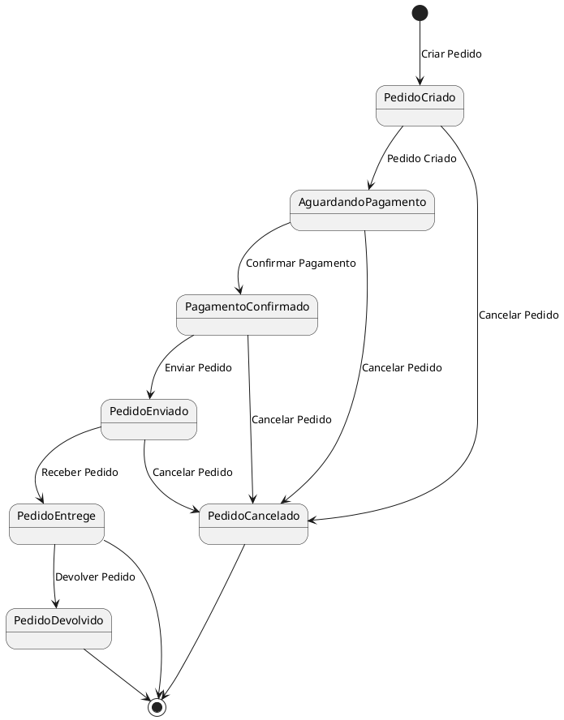
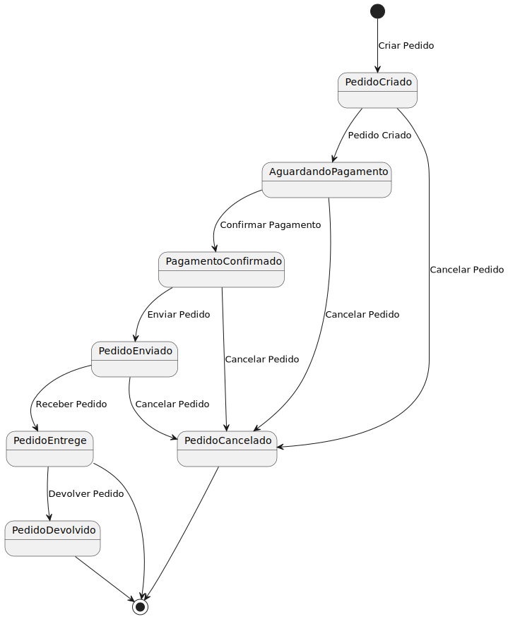

```plantuml
@startuml 
[*] --> PedidoCriado : Criar Pedido
PedidoCriado  --> AguardandoPagamento : Pedido Criado
AguardandoPagamento --> PagamentoConfirmado : Confirmar Pagamento
PagamentoConfirmado --> PedidoEnviado : Enviar Pedido
PedidoEnviado --> PedidoEntrege : Receber Pedido

PedidoCriado --> PedidoCancelado : Cancelar Pedido
AguardandoPagamento --> PedidoCancelado : Cancelar Pedido
PagamentoConfirmado --> PedidoCancelado : Cancelar Pedido
PedidoEnviado --> PedidoCancelado : Cancelar Pedido
PedidoEntrege --> PedidoDevolvido : Devolver Pedido

PedidoCancelado --> [*]
PedidoEntrege  --> [*]
PedidoDevolvido --> [*]

@enduml
```

